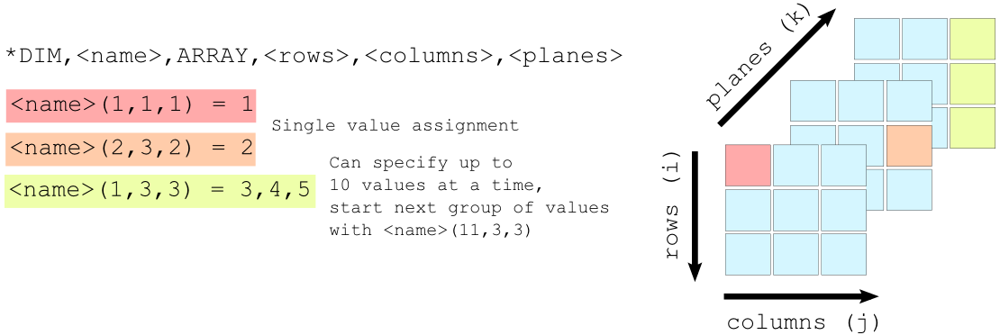
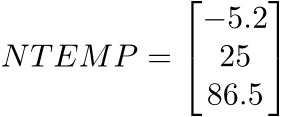
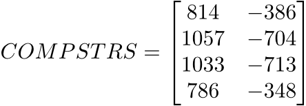

# ARRAY

在APDL中有3类参数：变量(数字或8位字符串)，向量，和表格。表格作为参数最为
特殊，其指标是实数，而非整数。当引用一个值时，程序会对该值所在位置做出插
值。如图所示可知向量和表格之间的差别。


## 定义语法

```
*DIM, <name>, ARRAY, <rows>, <columns>, <planes>
```

示例：


```
    *dim,ntemp,array,3
    ntemp(1) = -5.2, 25, 86.5
```



```
    *dim,compstrs,array,4,2
    compstrs(1,1) = 814, 1057, 1033, 786
    compstrs(1,2) = -386, -704, -713, -348
```




## 参考

- [ARRAYS AND TABLES IN APDL](https://www.ozeninc.com/apdl-arrays-tables-quickreference/)