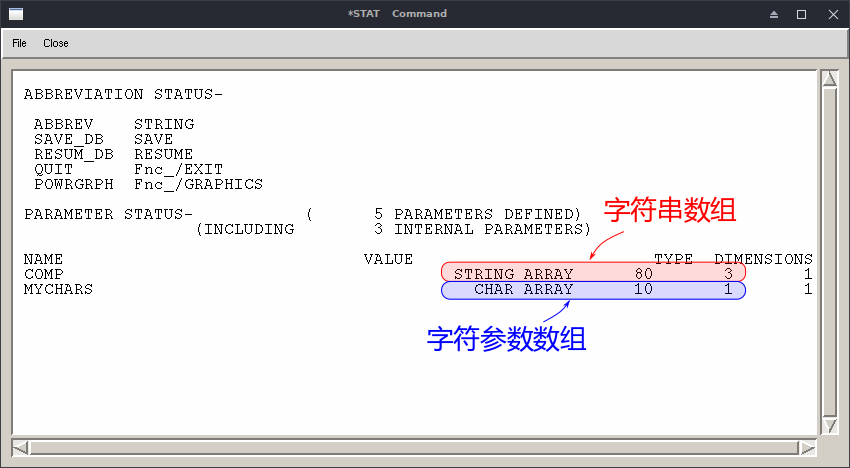

# 字符串

字符串(character strings)在APDL中可按两种方式存储：`字符参数(character
parameter)`和`字符数组(string array)`。

## 字符参数

字符参数在使用中不必使用指标，也不必使用`*dim`命令，它被作为一个标量变
量使用。但它量多只能有8个字符。比如：

```
myChr = 'yeehah'
/title,Working on Model %myChr%
```

## 字符数组

为了避免大小限制，就要使用字符数组，需要用到`*dim`命令：

```
*DIM, myString, STRING, 80
```

这将会定义一个字符串，长度为80，变量名为`myString`。引用该变量时，需要
用到`变量名`和`起始指标，即1`。比如：

```
/title, Working on Model %myString(1)%
/com, %myString(1)%
```


## 要点

在使用字符串需谨记如下要点：

- 定义字符串值时，需用单引号括住文字，如`'text'`；
- 最长的字符数组长度为256，但可以将字符数组结串使用； 
- 字符数组可以是2维的，若有一串字符数组使用，可用`*dim`处理；
- 亦可用字符参数数组(CHAR)，此时即为若干字符参数构成的列表；
- 查看哪些量是字符参数数组，哪些是2维字符数组，使用命令`*stat`。

## 字符数组

在定义数组时，分别按类型为分为`字符参数`和`字符串`类型：

- `CHAR`, 最多8个字符；
- `STRING`, 最多为IMAX个字符，IMAX为8的整数倍，最大值为248。

`*dim`的语法为：
```
*DIM, Par, Type, IMAX, JMAX, KMAX, Var1, Var2, Var3, CSYSID
```

对于`Type=CHAR`时，`IMAX`表示数组的长度；而对于`Type=STRING`时，
`IMAX`表示每个字符数组的大小，该值为8的整数倍，量大值为248。

事实上，`IMAX`表示的都是数组的行数，而`JMAX`表示的是数组的列数。
`STRING`数组是将每个字符串沿列方向存储的，相应大小自然受到行数的限制。

## 从文件读入CHAR数组

若有文件name.txt：
```
job1 txt
job2 jpg
job3  db
```
则定义CHAR数组后，即可由`*vread`读入：

```
    /inquire,my_lines,lines,name,txt
    *dim,filename,char,my_lines,2
    *vread,filename,name,txt,,jik,2,my_lines
    (2A4)
    parsav,all,text,parm
```

## 从文件读入STRING数组
如果想从文本文件中读取STRING数组，方式要简单得多，用`*sread`命令：
```
    *dim,filename,string
    *sread,filename,name,txt
```
刚可读入：
```
    filename(1,1)内容为'job1 txt'
    filename(1,2)内容为'job2 jpg'
    filename(1,3)内容为'job3  db'
```
分析以上代码可知：
- STRING数组定义其实是不必定义大小的，它会在读入文本时自动确定所需维数。
- 虽然STRING数组的索引一定使用起始指标，然而在读入时却不必使用指标。
- 每行文字按顺序存入数组的列，数组行数取为可容纳最多行字符的8的倍数。
  （比如第一行含9个字符，则filename的行数变为16，相应所有列的维数为16）

又，读入sectionname.txt中的所有文件名：
```
    % 从sectionname.txt中访问行数
    /inquire,my_lines,lines,sectionname,txt
    % 定义字符串数组，每个字符串最多16个字符
    *dim,secfile,string,16,my_lines
    % 从sectionname.txt中读取secfile字符串
    *sread,secfile(1),sectionname,txt
```

## CHAR数组和SRING数组的区别

我们还需要注意CHAR数组与STRING数组的重要区别：CHAR数组的单元（也就是最
小单位）是一个不超过8个字符的字符串，而STRING数组的单元是一个字符。

## 字符串函数

### 字符串转为和转自数字

| 函数            | 描述         |
| ---             | ----         |
| VALCHR(string)  | 	转为数字 |
| CHRVAL(num)	 | 转自数字     |

### 标准字符串函数

| 函数                    | 描述                                         |
| ---                     | ----                                         |
| STRSUB(Str1,nLoc,nChar) | 返回Str1的子串，从第nLoc字符到nLoc+nChar字符 |
| STRCAT(Str1,Str2)	   | 返回 Str1 + Str2                             |
| STRLENG(Str1)           | 返回Str1长度                                 |
| UPCASE(Str1)            | 返回大写                                     |
| LWCASE(Str1)            | 返回小写                                     |

### 文件名函数

| 函数                               | 描述                           |
| ---                                | ----                           |
| JOIN(directory,filename,extension) | 在当前系统中生成一个路径字符串 |
| Split(Path,Option)                 | 将一个完整路径名分解，选项为： |
|                                    | DIR = 仅给出目录               |
|                                    | FILE = 仅给出文件和扩展名      |
|                                    | Name = 仅给出文件名            |
|                                    | EXT = 仅给出扩展名             |

## 字符替代

任何CHAR或STRING字符参数被一对百分号包括后，即可被其内容所替换。比如：
```
/title, Results for Substep %isbstp%.  Freq = %frq%
```
另外，按这种方式，数字亦可替代，比如：
```
cmsel,s,ncmp%i%
```
当`i=32`时，程序执行时相当于`ncomp32`。

## 测试


```
    % 定义一个长度为10的字符参数数组
    *dim, mychars, char, 10
    mychars(1) = 'dog'
    mychars(2) = 'cat'
    /com,%mychars(1)%
    /com,%mychars(2)%

    % 定义一个80x3(80行3列)的2维字符数组，也可称为字符串数组
    % 每个字符数组沿列存储
    *dim,comp,string,80,3
    comp(1,1) = 'leftSide'  % 第1列值
    comp(1,2) = 'rightside' % 第2列值
    comp(1,3) = 'topside'   % 第3列值

    *stat
```

显示结果，如图：




## 参考

- [Manipulating Text Strings in ANSYS Mechanical
  APDL](http://www.padtinc.com/blog/manipulating-text-strings-in-ansys-mechanical-apdl/)
- *DIM, Mechanical APDL Command Reference 
