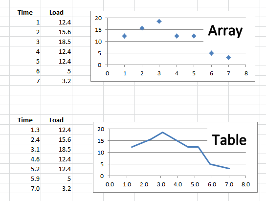

# 表格

在APDL中有3类参数：变量(数字或8位字符串)，向量，和表格。表格作为参数最为
特殊，其指标是实数，而非整数。当引用一个值时，程序会对该值所在位置做出插
值。如图所示可知向量和表格之间的差别。



## 定义

定义一个向量很容易：
```
    *dim,val,,7
    val(1) = 12.4,15.6,18.5,12.4,12.4,5,3.2
```

但定义一个表，需要3步：
- 用`*DIM`定义表: `Type=table`； 
- 定义指标(横轴): 命令`*TAXIS`，第1个参数是变量名，第2个参数是起始行，后
  面即为所有指标值；
- 提供值：表值

```
    *dim,val,table,7
    *taxis,val(1),1,1.3,2.4,3.1,4.6,5.2,5.9,7.0
    val(1) = 12.4,15.6,18.5,12.4,12.4,5,3.2
```

多维表定义示例：

```
    *dim,temptab,table,3,3,3
    *taxis,temptab(1,1,1),1,0,5,10
    *taxis,temptab(1,1,1),2,0,5,10
    *taxis,temptab(1,1,1),3,0,5,10
    temptab(1,1,1) = 10,100,10
    temptab(1,2,1) = 12,150,10
    temptab(1,3,1) = 10,90,7
    temptab(1,1,2) = 12,120,12
    temptab(1,2,2) = 15,180,15
    temptab(1,3,2) = 17,90,12
    temptab(1,1,3) = 20,200,20
    temptab(1,2,3) = 22,250,20
    temptab(1,3,3) = 20,290,27
```

## 参考

- [What Every User Should Know About Tables in ANSYS Mechanical APDL](http://www.padtinc.com/blog/what-every-user-should-know-about-tables-in-ansys-mechanical-apdl/)