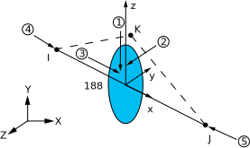

# BEAM188

3-D 2节点梁

## 单元描述

BEAM188几何信息：



## 单元技术和用法建议

## 输入数据

## 截面

BEAM188用关联如下截面：

- `SECTYPE,,BEAM`
- `SECTYPE,,GENB`
- `SECTYPE,,TAPER`
- `SECTYPE,,COMB,MATRIX`

## 荷载

## 输入摘要

- 节点 
    
    I,J,K,L (方向节点L可选但推荐)

- 表面荷载

  + Pressure
      
      face 1 (I-J) (沿-z轴方向，对梁的法向方向)
      face 2 (I-J) (沿-y轴方向，对梁的法向方向)
      face 3 (I-J) (沿+x轴方向，对梁的切向方向)
      face 4 (I) (沿+x轴方向)
      face 5 (J) (沿-x轴方向)

## 输出数据

| 输出量名称 | Item  | I |  J |
|------------|-------|---|----|
| Fx         | SMISC | 1 | 14 |
| My         | SMISC | 2 | 15 |
| Mz         | SMISC | 3 | 16 |


## 假定和限制


## 示例代码

```
! 设置单元KEYOPT(9)=3，KEYOPT(3)=3
et,1,beam188
keyopt,1,9,3                  ! output at intermediate locations
keyopt,1,3,3                  ! cubic shape function
```