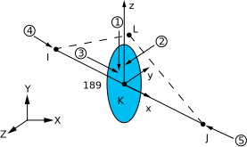

# BEAM189

3-D 3节点梁

## 单元描述

BEAM189几何信息：



## 输入数据

## 输入摘要

- 节点 
    
    I,J,K,L (方向节点L可选但推荐)

- 表面荷载

  + Pressure
      
      face 1 (I-J) (沿-z轴方向，对梁的法向方向)
      face 2 (I-J) (沿-y轴方向，对梁的法向方向)
      face 3 (I-J) (沿+x轴方向，对梁的切向方向)
      face 4 (I) (沿+x轴方向)
      face 5 (J) (沿-x轴方向)

## 输出数据

| 输出量名称 | Item  | I |  J |
|------------|-------|---|----|
| Fx         | SMISC | 1 | 14 |
| My         | SMISC | 2 | 15 |
| Mz         | SMISC | 3 | 16 |


## 假定和限制

- 假定为直杆，在两端受轴力，截面均匀。
- 杆长大于0，故节点I和J不能重合。
- 截面面积大于0。
- 位移形函数决定了杆件应力是均匀的。
- 应力刚化包含在几何非线性分析中(NLGEOM, ON)。预应力效应可由`PSTRES`命令
  激活。
- 若模拟单向受压/受拉选项，需要进行非线性迭代求解。

## 示例代码

```
! 获取单元31的输出量赋给ten变量，取smisc项的数字1，即轴力
*get, ten, elem, 31,smisc, 1
```