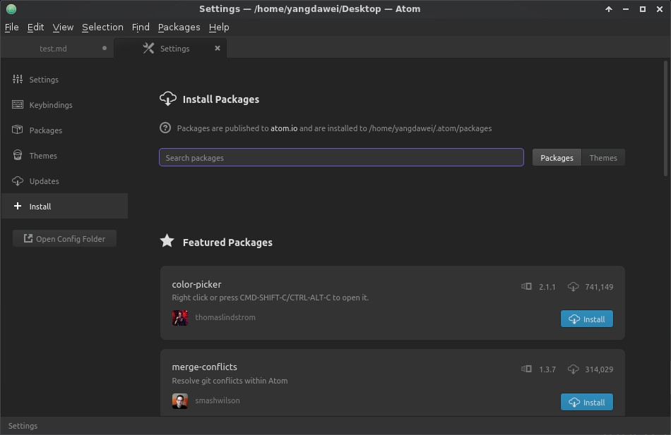
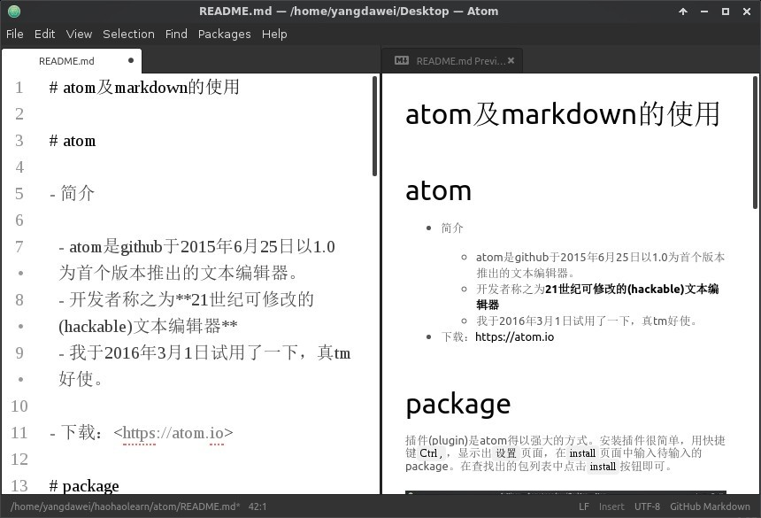

# atom及markdown的使用

# atom

- 简介

  - atom是github于2015年6月25日以1.0为首个版本推出的文本编辑器。
  - 开发者称之为**21世纪可修改的(hackable)文本编辑器**
  - 我于2016年3月1日试用了一下，真tm好使。

- 下载：<https://atom.io>

# package

插件(plugin)是atom得以强大的方式。安装插件很简单，用快捷键`Ctrl  ,`，显示出`设置`页面，在`install`页面中输入待输入的package。在查找出的包列表中点击`install`按钮即可。

注意，有两种插件：一是功能插件，也称为包(package)，二是主题(theme)。顺手推荐几个插件：

- isotope theme 高贵清晰，有利于装逼。
- vim-mode 用vim方式编辑文本，嗖嗖地感觉。(不会vim暂时不要安装，但推荐学会它，最正确地学习时机是"现在、立刻、马上，急切的不要不要的姿势")

# theme

设置好主题，便于使用： - UI theme: Isotope - Syntax theme: Atom Light

# markdown

- markdown是一种轻量极标记语言。
- 它有很多优点，对我而言只有两个：`好学`、`漂酿`。
- 链接很多，这是其中一个 [Markdown----入门指南](http://www.jianshu.com/p/1e402922ee32)

下面是关于markdown的插件：

- markdown-pdf 将markdown文本输出为pdf文件。
- markdown-writer 暂时不会写markdown吗？有了它用菜单就行了。
- markdown-preview 边写边看到效果。这个不用安装了，是核心包，自带的(`ctrl+shift+m`)。
- markdown-scroll-sync 编辑视图与preview视图同步滚动。

# 开始你的atom旅行吧

## 关于atom的温情链接

[官方手册：Atom 基础使用](https://atom-china.org/t/guan-fang-shou-ce-atom-ji-chu-shi-yong/62)
