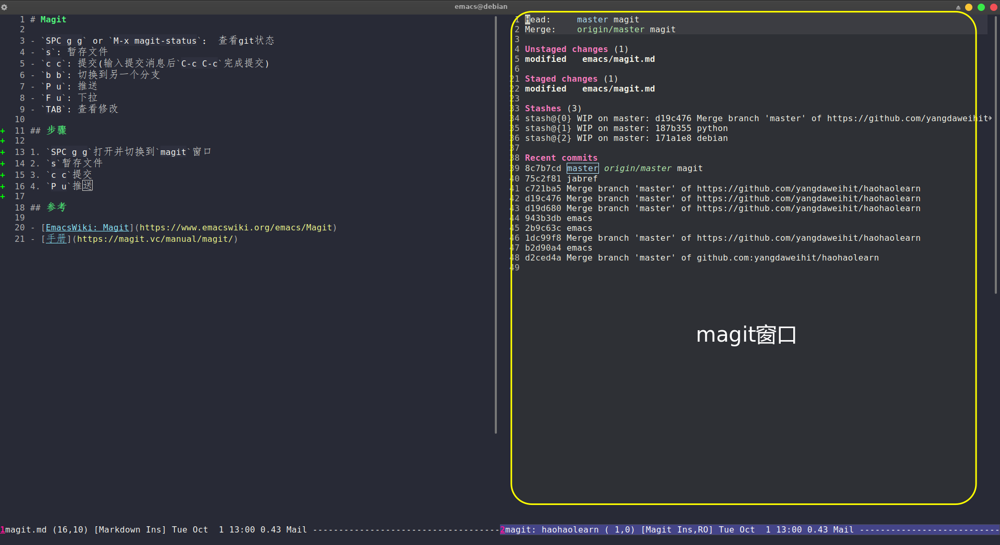

# Magit

- `SPC g g` or `M-x magit-status`： 查看git状态
- `s`: 暂存文件
- `c c`: 提交(输入提交消息后`C-c C-c`完成提交)
- `b b`: 切换到另一个分支
- `P u`: 推送
- `F u`: 下拉
- `TAB`: 查看修改

## 步骤

1. `SPC g g`打开并切换到`magit`窗口
2. `s`暂存文件
3. `c c`提交
4. `P u`推送

## 参考

- [EmacsWiki: Magit](https://www.emacswiki.org/emacs/Magit)
- [手册](https://magit.vc/manual/magit/)
