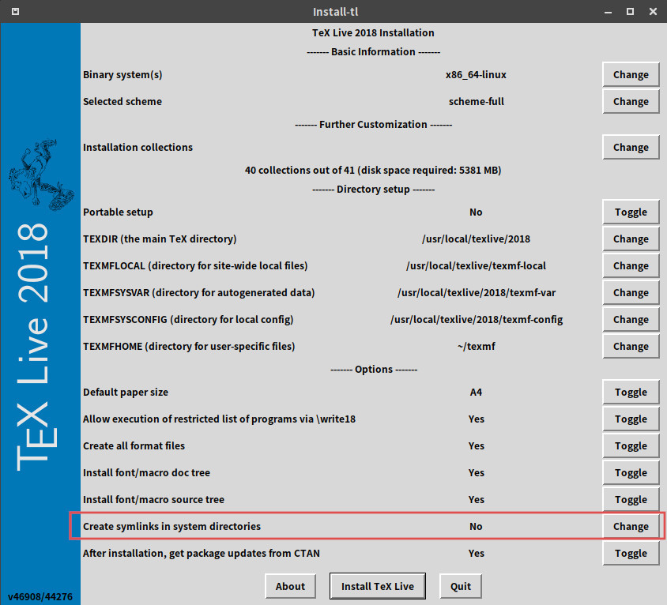

# TeX Live

TeX Live 是一款编译TeX文档的产品系统，提供了适用于Unix、GNU/Linux，和Windows中运行的TeX系统。维护者为[TUG, TeX Users Group](tug.org)。该系统下载方式有很多种，见`http://tug.org/texlive/`。

## 下载
最快倢的方式是通过国内镜像网站下载：见`http://tug.org/texlive/acquire-netinstall.html`中的[list of CTAN mirrors](https://ctan.org/mirrors)，选择中国任意镜像网站即可，如[mirrors.ustc.edu.cn](http://mirrors.ustc.edu.cn/CTAN/)中的[TeXLive](http://mirrors.ustc.edu.cn/CTAN/systems/texlive/):

   - [中国科技大镜像](http://mirrors.ustc.edu.cn/CTAN/systems/texlive/Images/)
   - [清华镜像](https://mirrors.tuna.tsinghua.edu.cn/CTAN/systems/texlive/Images/)

TeXLive每年发布一个新版本，下载目录中的任意镜像文件即可。


## 安装

- Windows:  运行`install-tl-advanced.bat`
- Linux: `sudo ./install-tl`；若安装了`perl-tk`，还可以图形界面安装：`sudo ./install-tl --gui`
- 注意：`生成系统目录链接`置于`Yes`



## tlmgr

`tlmgr`是`TeX Live manager`的缩写，意为`TeXLive`管理器。要使用窗口界面运
行`tlmgr`，需要安装`perl-tk`。

定义镜像源：
```
sudo tlmgr option repository https://mirrors.ustc.edu.cn/CTAN/systems/texlive/tlnet/
```
更新宏包、管理器、所有文件：
```
sudo tlmgr update <package>
sudo tlmgr update --self
sudo tlmgr update --all
```


## 私有文件安装

本地文件夹目录：

```
kpsewhich -var-value TEXMFLOCAL
```

所谓私有文件，即一些未安到到`texmf`目录树中的宏包或字体，它们需要被置于
用户文件夹中。`TDS标准`给用户分配了一个环境变量`TEXMFHOME`。通过如下命令
检查`TEXMFHOME`变量：

```
kpsewhich -var-value TEXMFHOME
kpsewhich -expand-var '$TEXMFHOME'
```

定义`TEXMFHOME`的文件为`texmf.cnf`，要了解该文件的位置，可用命令：
```
kpsewhich texmf.cnf
```

按如下方式定义用户的`TEXMFHOME`：
- make directory in home path: `.texmf`
- edit `/usr/local/texlive/2019/texmf.cnf`
- add: `TEXMFHOME=~/.texmf`
- create texmf tds in `.texmf`
- copy cls and sty files in to tds of `.texmf`

## 参考

- [Installation using TeX Live manager](https://texfaq.org/FAQ-inst-texlive "tlmgr")
- [Which tree to use](https://texfaq.org/FAQ-what-TDS "TDS")
- [Private installations of files](https://texfaq.org/FAQ-privinst "TEXMFHOME")
- [Where is “texmf” on a Windows install](https://tex.stackexchange.com/questions/12701/where-is-texmf-on-a-windows-install)