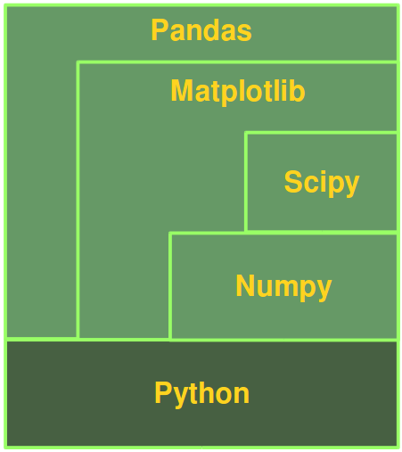

# 数值编程

## 定义

## 数据科学与数据分析

## Python, Numpy, Matplotlib, Scipy 和Pandas的关系

- 没有数值模块的原始Python不能用于如Matlab，R等其它语言所做的数值任务。
- 若使用Numpy，Scipy，Matplotlib，Pandas模块，则成为顶级的数值编程语言。
  效率甚至高于Matlab和R。

- Numpy提供基本数据结构，多维数组或矩阵，操作数据结构的函数。
- Scipy基于Numpy的数据结构，提供了最小化、回归、付立叶变换等很多函数。
- Matplotlib是用于Python绘图库。
- Pandas是基本上述所有库，其主要目的是提供数据结构和操作用于控制数值表和
  时序数据。命名来自于"panel data"。

## 参考

- [Numerical Programming with Python](https://www.python-course.eu/numerical_programming_with_python.php)
- [Numpy Tutorial](https://www.python-course.eu/numpy.php)