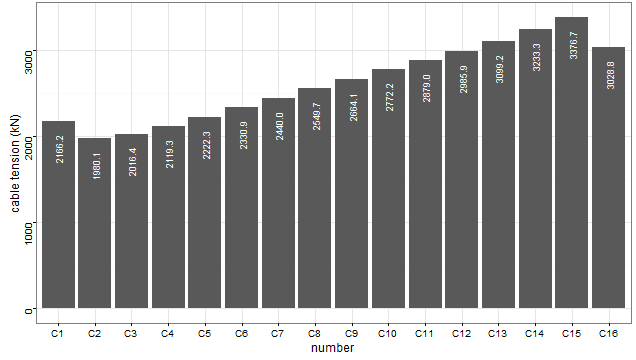

# 准备

## 教材
   - Hadley Wickham, ggplot2: Elegant Graphics for Data Analysis, Springer, 2009

## 参考
   - <http://docs.ggplot2.org/current/>
   - <https://github.com/hadley/ggplot2/wiki>

## 下载
   - <https://pan.baidu.com/s/1skDlxQd>

# 示例

## 索力柱状图

- 描述：给定索力数据文件data.txt，绘制索力柱状图。



- 源码：

```
#  Function：
#
#  by Xu wenjing
#  Harbin Institute of Technology
#  Mar. 10 2016
```
## 矩阵热图

- 描述：将矩阵用热图表达，直观而简洁。
- 参考：<http://www.sthda.com/english/wiki/ggplot2-quick-correlation-matrix-heatmap-r-software-and-data-visualization>


