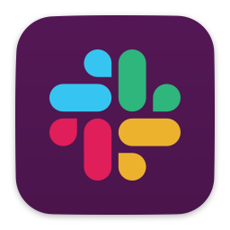
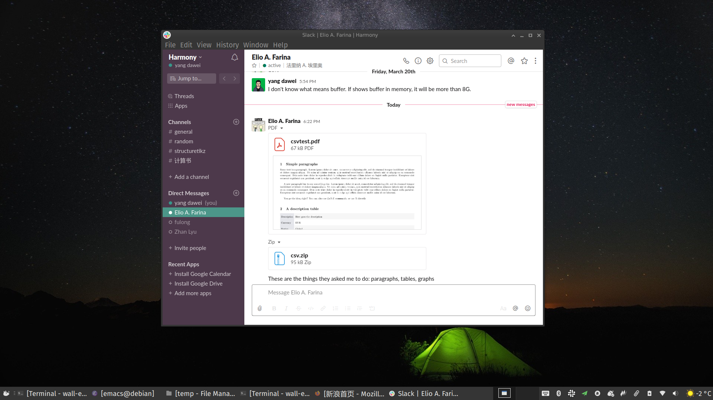

# SLACK

[Slack](https://slack.com/intl/en-cn/)是2013年诞生的通信软件，与社交即时通信软件不同，它面向协同工作场景。使用Slack需要非常谨慎，因为一旦获得了舒适的体验，你将难以忍受在社交即时消息软件中工作。

> "Slack" is a [backronym](https://en.wikipedia.org/wiki/Backronym) for "Searchable Log of All Conversation and Knowledge."

## 功能

Slac有很多类似IRC类的功能，如永久聊天室（或称频道），包括文件和对话在内的内容和人，均可以Slack中搜索。

- 团队

  Slack团队让社区、群、组联合成工作空间，管理员或拥有者可通过URL或邀请发送给成员加入。

- 消息

  公共频道允许团队成员进行交流，该类频道向所有工间中的成员开放。

  私有频道仅在子群中进行私有对话。

  直接对话发生于特定用户之间。

- API

  Slack开放的API可以绑定很多其它应用程序、框架或服务。

## 平台

- iOS
- Android
- macOS
- Windows: https://slack.com/intl/en-cn/downloads/windows
- Linux: https://slack.com/intl/en-cn/downloads/linux
- Apple Watch

## 商用

Slack是一款**freemium**产品(即免费+付费定价策略)，付费功能体现在：

- 超过10, 000条压缩消息
- 增加非限制的应用和集成功能

## 个人体验

- 优点
  - 永久存储消息，包括附件
  - 消息格式markdown渲染，适合用于技术交流
  - 国际交流首选

- 缺点

  - 有时访问官网速度慢

  - 中毒以后freemium让你终有一天跳入付费坑，欣赏一下它的[价格表](https://slack.com/intl/en-cn/pricing)吧。

附注：本文可能会被更新，请好奇者访问[最新版本](https://github.com/yangdaweihit/haohaolearn/tree/master/slack)。
