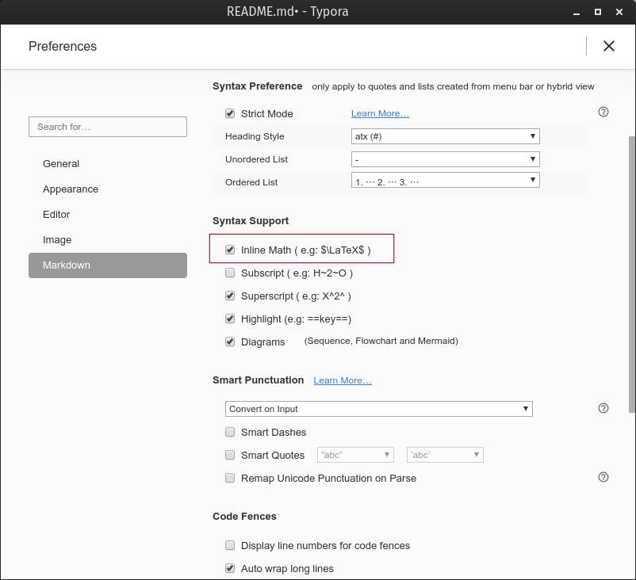

#  Markdown + Typora

<div align="center">
 &emsp; &emsp;&emsp; 
</div>
这是一个关于写文档的文档。


- 参考：
  - https://support.typora.io/Markdown-Reference/
  - https://zh.wikipedia.org/zh-hans/Markdown
- 本文档在持续更新中，最新版本请察看[这里](https://github.com/yangdaweihit/haohaolearn/blob/master/typora/README.md)
- 本文试图回答如下问题：
  - Why Markdown：撰写简单高效、文档素雅简约彰显您的高端大气；
  - [啥Markdown](#简介)：Markdown简介；
  - [咋Markdown](#Markdown语法)：[下载](https://typora.io/#download)安装Typora，按本文说明的语法写就完了。
- 本文无意回答如下问题：
  - Markdown啥：原则上啥都行，具体爱啥啥。
  - 文中涉及的非Markdown概念：如`YAML`、`Emoji`。
- 若您正在阅读本文的PDF格式版本，则文内的`动画插图`可能无效。
- 若您正在Github中阅读本文的Markdown版本，则文内的`数学式`渲染可能无效。


## 简介

**Markdown**是一种[轻量级标记语言](https://zh.wikipedia.org/wiki/轻量级标记语言)，创始人为[约翰·格鲁伯](https://zh.wikipedia.org/wiki/約翰·格魯伯)（英语：John Gruber）。它允许人们使用易读易写的纯文本格式编写文档，然后转换成有效的[XHTML](https://zh.wikipedia.org/wiki/XHTML)（或者[HTML](https://zh.wikipedia.org/wiki/HTML)）文档。这种语言吸收了很多在[电子邮件](https://zh.wikipedia.org/wiki/电子邮件)中已有的纯文本标记的特性。

由于Markdown的轻量化、易读易写特性，并且对于图片，图表、数学式都有支持，目前许多网站都广泛使用Markdown来撰写说明文件或是用于[论坛](https://zh.wikipedia.org/wiki/网络论坛)上发表讯息。如GitHub、Reddit、Diaspora、Stack Exchange、OpenStreetMap 、SourceForge、[简书](https://zh.wikipedia.org/wiki/简书)等，甚至还能被使用来撰写[电子书](https://zh.wikipedia.org/wiki/電子書)。

更多关于Markdown的介绍见[这里](https://zh.wikipedia.org/zh-hans/Markdown)。

[Typora](https://typora.io/)是目前我们见到的撰写Markdown文档的最佳工具，还是Markdown的最佳阅读器。本文介绍了[Typora](https://typora.io/)所支持的Markdown语法格式和渲染方式。

[HOME](#Markdown + Typora)

## Markdown语法


### 块单元

---

#### 段落和行断

- 一个段落即连续的文字行。
- 段落由一个或多个空白行分隔。
- 回车(`Return`)生成一个新的段落。
- 快捷键：`Ctrl + 0`

[HOME](#Markdown + Typora)

#### 标题

标题使用1-6个`#`开头，对应1-6级标题。如：

```

# This is an H1 

## This is an H2 

###### This is an H6

```

- 快捷键：`Ctrl + 1`表示1级标题，以此类推。

[HOME](#Markdown + Typora)

#### 块引用

Markdown用邮件样式`>`符号表示块引用。

源码：

```
> This is a blockquote with two paragraphs. This is first paragraph.
>
> This is second pragraph. Vestibulum enim wisi, viverra nec, fringilla in, laoreet vitae, risus.
```

渲染：

> This is a blockquote with two paragraphs. This is first paragraph.
>
> This is second pragraph. Vestibulum enim wisi, viverra nec, fringilla in, laoreet vitae, risus.

- 快捷键：`Ctrl + Shif + Q`。

[HOME](#Markdown + Typora)

#### 列表

- 键入`*`建立一个无顺序列表。（`*`可被`+`或`-`替代）

- 键入`1.`生成一个有顺序列表。

  ```
  ## 无序列表
  *   Red
  *   Green
  *   Blue
  
  ## 有序列表
  1.  Red
  2. 	Green
  3.	Blue
  ```

+ 按`Tab`键可向下级转换列表层级。
+ 按`Shift + Tab`键可向上级转换列表层级。

[HOME](#Markdown + Typora)

#### 任务列表

任务列表用`[ ]`或`[x]`标识，如：

```
- [ ] a task list item
- [ ] list syntax required
- [ ] normal **formatting**, @mentions, #1234 refs
- [ ] incomplete
- [x] completed
```

- [ ] a task list item 

- [x] list syntax required 
- [x] normal ***\*formatting\****, @mentions, #1234 refs 
- [ ] incomplete 
- [x] completed

[HOME](#Markdown + Typora)

#### 代码块

Typora只支持Github风格的代码块Markdown语法，而不是Markdown原始的代码块样式。

使用代码块很容易，键入\```，然后回车。在\```后面跟上一个语言名称，可以对代码进行相应的语法高亮渲染。

源码：

```
​```
function test() {
  console.log("notice the blank line before this function?");
}
​```

语法高亮:
​```ruby
require 'redcarpet'
markdown = Redcarpet.new("Hello World!")
puts markdown.to_html
​```
```
渲染：
```
function test() {
  console.log("notice the blank line before this function?");
}
```

```ruby
require 'redcarpet'
markdown = Redcarpet.new("Hello World!")
puts markdown.to_html
```

[HOME](#Markdown + Typora)

#### 数学式块

Typora可使用**MathJax**渲染$\LaTeX{}$。

- 换成其它编辑器，尚没有找到这样立等可取的效果。
- 若在Github上察看本文档，你将无法看到公式被渲染的效果。因为我们没法在markdown文档中加入Mathjax引擎。
- 在Typora中这些工作都被自动完成。
- 鼠标单击渲染后的公式，数学式块自动切换为源码，并弹出菜单动态显示出对应的渲染公式。

要添加一个数学式，可输入`$$`后按`Return`键。如：

$$\mathbf{V}_1 \times \mathbf{V}_2 =  \begin{vmatrix} \mathbf{i} & \mathbf{j} & \mathbf{k} \\ \frac{\partial X}{\partial u} &  \frac{\partial Y}{\partial u} & 0 \\ \frac{\partial X}{\partial v} &  \frac{\partial Y}{\partial v} & 0 \\ \end{vmatrix} $$ 

其代码为：

```
$$
\mathbf{V}_1 \times \mathbf{V}_2 =  \begin{vmatrix}
\mathbf{i} & \mathbf{j} & \mathbf{k} \\
\frac{\partial X}{\partial u} &  \frac{\partial Y}{\partial u} & 0 \\
\frac{\partial X}{\partial v} &  \frac{\partial Y}{\partial v} & 0 \\
\end{vmatrix}
$$
```

 更多细节在[这里](https://support.typora.io/Math/)。再来一个漂亮的公式吧：
$$
\begin{align*}
y = y(x,t) &= A e^{i\theta} \\
&= A (\cos \theta + i \sin \theta) \\
&= A (\cos(kx - \omega t) + i \sin(kx - \omega t)) \\
&= A\cos(kx - \omega t) + i A\sin(kx - \omega t)  \\
&= A\cos \Big(\frac{2\pi}{\lambda}x - \frac{2\pi v}{\lambda} t \Big) + i A\sin \Big(\frac{2\pi}{\lambda}x - \frac{2\pi v}{\lambda} t \Big)  \\
&= A\cos \frac{2\pi}{\lambda} (x - v t) + i A\sin \frac{2\pi}{\lambda} (x - v t)
\end{align*}
$$

[HOME](#Markdown + Typora)

#### 表格

- Typora将标准Markdown的表格功能做了多方面的扩展，不仅有图形界面，还可以直接写源码。
- 键入 `| 第一个标题 | 第二个标题 |` 再按`return`键即可生成一个两列的表格。
- 当一个表格生成后，将鼠标放在表格中时将会在表格上方显示一个工具栏，可由此重设表格大小、对齐、或删除表格。还可用上下文菜单拷贝、增加、删除各别列或行。
- 表格的完整语法描述如下，但因为表格源码可由Typora自动生成，所以也没必要知道所有语法。
- 快捷键： `Ctrl + T`

Markdown表格源码：

```
| First Header | Second Header |    
| ------------ | ------------- |     
| Content Cell | Content Cell  |    
| Content Cell | Content Cell  |
```

- 可在表格里应用行内Markdown语法，如链接、粗体、斜体、或删除线。

- 在标题行内插入冒号（`:`）可以设置左对齐、右对齐、或居中。

```
| Left-Aligned  | Center Aligned  | Right Aligned |
| :------------ |:---------------:| -------------:|
| col 3 is      | some wordy text | $1600         |
| col 2 is      | centered        |   $12         |
| zebra stripes | are neat        |    $1         |
```

| Left-Aligned  | Center Aligned  | Right Aligned |
| :------------ | :-------------: | ------------: |
| col 3 is      | some wordy text |         $1600 |
| col 2 is      |    centered     |           $12 |
| zebra stripes |    are neat     |            $1 |

[HOME](#Markdown + Typora)

#### 脚释

- 鼠标点击脚释链接，可转向脚释引用，并可由引用后面的返回链接转回至脚释处。

源码：

```
You can create footnotes like this[^fn1] and this[^fn2]. 
[^fn1]: Here is the *text* of the first **footnote**.
[^fn2]: Here is the *text* of the second **footnote**.
```

效果：

You can create footnotes like this[^fn1] and this[^fn2]. 

[^fn1]: Here is the **text** of the first ***\*footnote\****. 
[^fn2]: 

- 鼠标悬停于上脚标时，可以看到脚释的内容。您可用任意唯一标识内容作为脚释标记。
- Or you can create **inline footnotes**, like this^[Here is the *text* of the first **footnote**.] and this[Here is the *text* of the second **footnote**.].

[HOME](#Markdown + Typora)

#### 水平线

在一个空行处输入 `***` 或`---`然后 `return`即可画出一条水平线。如：

---

[HOME](#Markdown + Typora)

#### YAML Front Matter

Typora现已支持[YAML Front Matter](http://jekyllrb.com/docs/frontmatter/)。在文档顶部输入`---`后按`Return`将引入一个元数据块，亦可由菜单插(Pragraph > YAML Front Matter)入元数据块。

#### 目录

- 输入`[toc]`后按`Return`即生成一个目录节。目录提取本文档中的所有标题，其内容将随文件内部动态更新。

- 在Typora中可以使用`outline`视图方便进行各标题跳转。
  - GUI: View > Outline
  - `Ctrl+Shift+1`

[HOME](#Markdown + Typora)

###   跨越单元

---

跨越单元将在输入文档后解析并渲染。将鼠标置于单元中间，单元将展开为源码。下面是每个跨越单元的语法解释。


#### 链接

Markdown支持两类链接：`inline`和`reference`。两种链接中，链接文字都被`[方括号]`包围。

##### 行内链接

- 在链接文字之后输入一对圆括号，括号中输入URL网址。
- 后面有一个可选项，双引号包围的文字表示该链接的标题。

源码：

```
This is [163](http://www.163.com/ "这是一个网易的链接") inline link.
[163](http://www.163.com/) has no title attribute.
```

渲染效果：

This is [163](http://www.163.com/ "这是一个网易的链接") inline link.
[163](http://www.163.com/) has no title attribute.

- 在Typora中，按住`Ctrl`键同时鼠标点击链接即可实现跳转。

[HOME](#Markdown + Typora)

##### 内部链接

用标题样式作为引用即可实现内部链接。按`Ctrl`键同时点击该链接即可跳转到引用处。如：

```
[返回](#Markdown使用说明)
```

[HOME](#Markdown + Typora)

##### 参考链接	

引用风格链接

<span style="color:red">未完待续，有空再整.... </span>

##### 

[HOME](#Markdown + Typora)

#### URLs

Typora支持用`<>`包含的地址作为链接，如`<i@typora.io>`变为： <i@typora.io>。

同时Typora亦可自动将标准地址格式变为链接。

[HOME](#Markdown + Typora)

#### 图片

插图与链接语法相同，只是在链接前额外加一个`!`。语法示例：

```
 

```

- 可直接拖拽图片到Typora里面。如下面的动画[^ani]所示：

  

- 若图片与文档在同一文件夹或子文件夹中，则默认采用相对路径。

[^ani]: 如果察看的是本文档的`PDF`格式版本，你将看不到下面的插图动画效果。

[HOME](#Markdown + Typora)

### 行内Markdown

---

#### 强调

- 强调用单个`*`下划线`_`引导，用一对引号符包括起来：

```
*single asterisks*
_single underscores_
```

**single asterisks** *_single underscores_*

- 要输入`*`号，可以前面加入`\`转义即可：`\*`即生成*。

[HOME](#Markdown + Typora)

#### 加粗

用两个`*`或`__`引导包围起来的文字即可加粗。

```
**double asterisks**
__double underscores__
```

**double asterisks**

__double underscores__

[HOME](#Markdown + Typora)

#### 代码

为显示行内代码，可用将文字用反向引用号(`)包围，如：

```
Use the `printf()` function.
```

Use the `printf()` function.

[HOME](#Markdown + Typora)

#### 删除线

GFM[^gfm]增加了删除线语法，这是标准Markdown语法没有的。

```
~~文字两边各有2个波浪号就渲染为删除线了~~
```

~~文字两边各有2个波浪号就渲染为删除线了~~

[^gfm]: [Github风格的Markdown语法](https://github.github.com/gfm/)

[HOME](#Markdown + Typora)

#### Emoji
绘文字用一个`:`号引导，即可输入Emoji符号。如：
```
:happy: :cry: :kissing_smiling_eyes: :email: :telephone: 
```
:happy: :cry: :kissing_smiling_eyes: :email: :telephone: :arrow_backward: [:leftwards_arrow_with_hook: ](#Markdown + Typora)

[HOME](#Markdown + Typora)

#### 行内数学式

为了使行内数学式得以渲染，需要在偏好面板(File > Preferences...)中`Markdown`勾选`Inline Math`项。



然后即可用`$`包围LaTeX命令，如：

```
例如：$\lim_{x \to \infty} \exp(-x) = 0$
```

例如：$\lim_{x \to \infty} \exp(-x) = 0$

[HOME](#Markdown + Typora)

#### 下角标

要使用此项功能，同样需要偏好面板`Markdown`中勾选`Subscript`项。被`~`包围的文字即渲染为下角标。

`H~2~O`, `X~long\ text~` 

H~2~0 X~long\ text~

[HOME](#Markdown + Typora)

#### 上角标

要使用此项功能，同样需要偏好面板`Markdown`中勾选`Supscript`项。被`^`包围的文字即渲染为上角标。

`X^2^`

X^2^

[HOME](#Markdown + Typora)

#### 高亮

要使用此项功能，同样需要偏好面板`Markdown`中勾选`Highlight`项。被`==`包围的文字即渲染为高亮。

`==highlight==`

==highlight==

[HOME](#Markdown + Typora)

### HTML

---

可使用HTML实现更多Markdown不具备的样式。如 `<span style="color:red">this text is red</span>`得到：

<span style="color:red">this text is red</span>。

#### 下划线

下划线在GFM中没有被定义，可以用HTML标签：`<u>Underline</u>`得到：<u>Underline</u>。

[HOME](#Markdown + Typora)

#### 视频

使用`<video>`标签可嵌入视频：

```Markdown
<video src="Shear in Beams Model.mp4" />
```

<video src="Shear in Beams Model.mp4"/>

[HOME](#Markdown + Typora)

#### 其它HTML支持

更多细节见[这里](http://support.typora.io/HTML/).

[HOME](#Markdown + Typora)